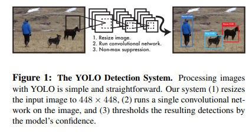
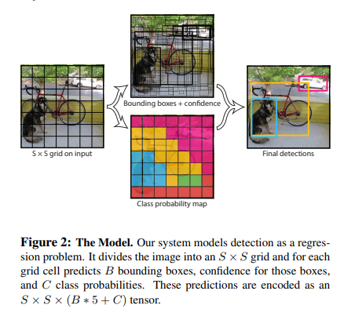
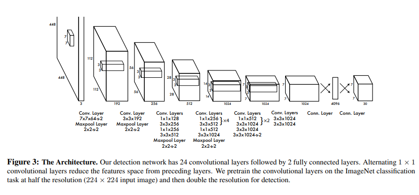
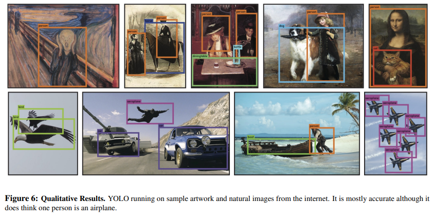

# 👀 YOLOv1-Paper-Replicating

- This repository contains a replication of the **YOLO: You Only Look Once – Unified, Real-Time Object Detection** paper by Joseph Redmon et al. The goal is to implement the YOLOv1 model as described in the original paper, preserving the architecture and core detection logic. This version focuses on YOLOv1 and its real-time detection pipeline.

**Paper**: [YOLO: You Only Look Once (arXiv 2016)](https://arxiv.org/abs/1506.02640)

---

## 🖼 Model Overview

- YOLOv1 approaches object detection as a single unified regression problem. Instead of using separate pipelines for region proposals, feature extraction, and classification, the model divides an input image into an S × S grid. Each grid cell is responsible for predicting a fixed number of bounding boxes, along with confidence scores and class probabilities. This end-to-end training on full images allows YOLOv1 to simultaneously learn object localization and classification, making it extremely fast while maintaining reasonable accuracy.

---

## 🗂 Project Structure

```bash
YOLOv1-Paper-Replicating/
│
├── src/
│   ├── backbone/
│   │   └── conv_block.py          # Conv2d + BatchNorm + LeakyReLU 
│   ├── detection_head/
│   │   └── yolo_layer.py          # B box prediction, confidence, class probabilities 
│   ├── utils/
│   │   └── grid_utils.py          # Grid cell coordinates and offset calculations 
│   ├── yolo_model.py              # Backbone + detection head integration (Overall architecture)
│   ├── mns_decode_and_visualize.py # after layer this is the key of visualize
│   └── config.py                  # Optional configuration for training parameters
│
├── images/
│   ├── fig1.png                    # YOLO model architecture overview
│   ├── fig2.png                    # Grid cell and bounding box illustration
│   ├── fig3.png                    # Convolutional layers example
│   └── fig6.png                    # Detection examples
│
└── requirements.txt

```
---
## 🖼 Figures

### Figure 1 – Model Architecture


- Shows the overall YOLOv1 architecture that extracts features and predicts bounding boxes and class probabilities in a single pass.

### Figure 2 – Grid and Bounding Boxes


- Illustrates how the image is divided into grid cells and how each cell predicts bounding boxes and class probabilities.

### Figure 3 – Convolutional Layers


- Visualizes some of the convolutional layers used in the backbone for feature extraction.

### Figure 6 – Detection Results


- Sample output showing predicted bounding boxes and class probabilities on test images.

---
## 🔗 Feedback

For feedback or questions, contact: [barkin.adiguzel@gmail.com](mailto:barkin.adiguzel@gmail.com)
